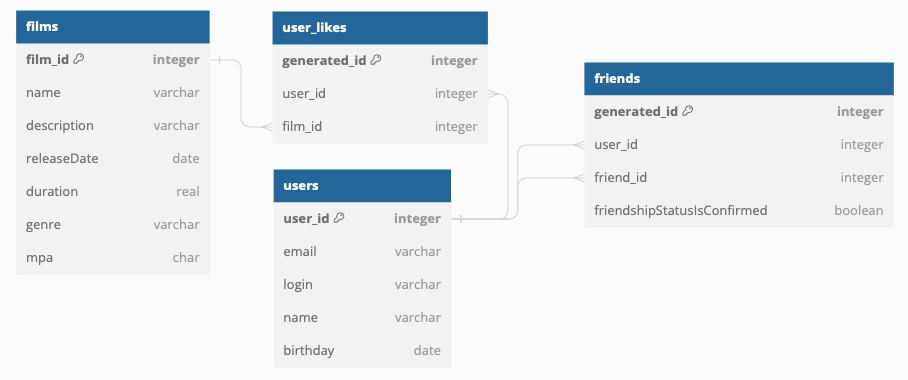

# Filmorate

Это бэкенд для сервиса, который работает с фильмами и оценками пользователей, а также возвращает топ-5 фильмов, рекомендованных к просмотру. 

____
Технологический стек: 
* Java 11
* Spring Boot
* JDBCTemplate
* H2
* Spring Boot Test
* Lombok
____

В проекте реализованы следующие **классы-контроллеры**:
* FilmController обслуживает фильмы
* UserController – пользователей
* GenreController – жанры
* MpaController – категории

В классах-контроллерах имеются эндпоинты с подходящим типом запроса для каждого из случаев.

Для FilmController:
* POST /films - добавление фильма;
* PUT /films - обновление фильма;
* GET /films - получение всех фильмов;
* GET /films/{filmId} – получение фильма по идентификатору;
* DELETE /films/{filmId} – удаление фильма;
* PUT /films/{id}/like/{userId} — пользователь ставит лайк фильму;
* DELETE /films/{id}/like/{userId} — пользователь удаляет лайк;
* GET /films/popular?count={count}&genreId={genreId}&year={year} — возвращает список из первых count фильмов по количеству лайков. Если значение параметра count не задано, вернутся первые 10. Фильтрация осуществляется по двум параметрам: по жанру, за указанный год.
* GET /films/common?userId={userId}&friendId={friendId} - возвращает список фильмов, отсортированных по популярности. Параметры: userId — идентификатор пользователя, запрашивающего информацию; friendId — идентификатор пользователя, с которым необходимо сравнить список фильмов.

Для UserController:
* POST /users - создание пользователя;
* PUT /users - обновление пользователя;
* DELETE /users/{userId} – удаление пользователя;
* GET /users/{userId} - получение данных о конкретном пользователе;
* GET /users - получение списка всех пользователей;
* PUT /users/{id}/friends/{friendId} — добавление в друзья;
* DELETE /users/{id}/friends/{friendId} — удаление из друзей;
* GET /users/{id}/friends — возвращает список пользователей, являющихся его друзьями;
* GET /users/{id}/friends/common/{otherId} — список друзей, общих с другим пользователем.

Для MpaController:
* GET /mpa – получение всех категорий MPA;
* GET /mpa/{id} – получение категории по идентификатору.

Для GenreController:
* GET /genres – получение списка всех жанров;
* GET /genres/{id} – получение жанра по идентификатору.

____
В прооекте используется база данных H2. База работает в двух режимах:
1. В режиме тестирования H2 хранит данные в памяти.
2. В рабочем режиме H2 хранит данные в файле на жёстком диске.

Данные о фильмах хранятся в таблице "films". Таблица состоит из полей:
- первичный ключ film_id — идентификатор фильма;
- film_name - название фильма;
- film_description - описание фильма;
- release_date - дата выхода фильма;
- duration - продолжительность фильма;
- rate - рейтинг фильма;
- rating_id - (отсылает к таблице "films_rating", тип связи - один ко многим) id рейтинга Ассоциации кинокомпаний (
  возрастной рейтинг).

Данные о пользователях хранятся в таблице "users". Таблица состоит из полей:
- первичный ключ user_id — идентификатор пользователя;
- email - электронная почта пользователя;
- login - логин пользователя;
- user_name - имя пользователя;
- birthday - дата рождения пользователя.

Чтобы отследить добавление друзей создана таблица "friends". Таблица состоит из полей:
- первичный ключ friendship_id - генерируемый ключ;
- внешний ключ user_id (отсылает к таблице "users", тип связи - один ко многим) - идентификатор пользователя;
- внешний ключ friend_id (отсылает к таблице "users", тип связи - один ко многим) - идентификатор пользователя.

Данные о жанрах хранятся в таблице "film_genres". Таблица состоит из полей:
- первичный ключ match_id - генерируемый ключ;
- внешний ключ genre_id (отсылает к таблице "genres", тип связи - один ко многим) — идентификатор жанра;
- внешний ключ film_id (отсылает к таблице "films", тип связи - один ко многим) — идентификатор фильма.

Данные о жанрах хранятся в таблице "genres". Таблица состоит из полей:
- первичный ключ genre_id — идентификатор жанра;
- genre_name - имя жанра.

Данные о пользователях хранятся в таблице "films_rating". Таблица состоит из полей:
- первичный ключ rating_id — идентификатор рейтинга;
- rating_name - имя рейтинга.
   
# Тестирование
Для проверки работы приложения с зависимостями использовано интеграционное тестирование. 
Для проверки кода использовались [тесты](https://github.com/yandex-praktikum/java-shareit/blob/add-controllers/postman/sprint.json)
