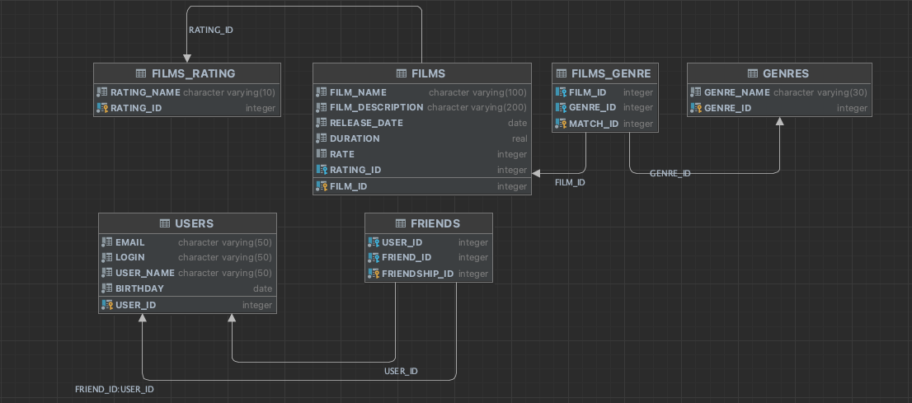

# java-filmorate

Template repository for Filmorate project.

Данные о фильмах хранятся в таблице "films". Таблица состоит из полей:
- первичный ключ film_id — идентификатор фильма;
- film_name - название фильма;
- film_description - описание фильма;
- release_date - дата выхода фильма;
- duration - продолжительность фильма;
- rate - рейтинг фильма;
- rating_id - (отсылает к таблице "films_rating", тип связи - один ко многим) id рейтинга Ассоциации кинокомпаний (
  возрастной рейтинг).

Данные о пользователях хранятся в таблице "users". Таблица состоит из полей:
- первичный ключ user_id — идентификатор пользователя;
- email - электронная почта пользователя;
- login - логин пользователя;
- user_name - имя пользователя;
- birthday - дата рождения пользователя.

Чтобы отследить добавление друзей создана таблица "friends". Таблица состоит из полей:
- первичный ключ friendship_id - генерируемый ключ;
- внешний ключ user_id (отсылает к таблице "users", тип связи - один ко многим) - идентификатор пользователя;
- внешний ключ friend_id (отсылает к таблице "users", тип связи - один ко многим) - идентификатор пользователя.

Данные о жанрах хранятся в таблице "film_genres". Таблица состоит из полей:
- первичный ключ match_id - генерируемый ключ;
- внешний ключ genre_id (отсылает к таблице "genres", тип связи - один ко многим) — идентификатор жанра;
- внешний ключ film_id (отсылает к таблице "films", тип связи - один ко многим) — идентификатор фильма.

Данные о жанрах хранятся в таблице "genres". Таблица состоит из полей:
- первичный ключ genre_id — идентификатор жанра;
- genre_name - имя жанра.

Данные о пользователях хранятся в таблице "films_rating". Таблица состоит из полей:
- первичный ключ rating_id — идентификатор рейтинга;
- rating_name - имя рейтинга.
   